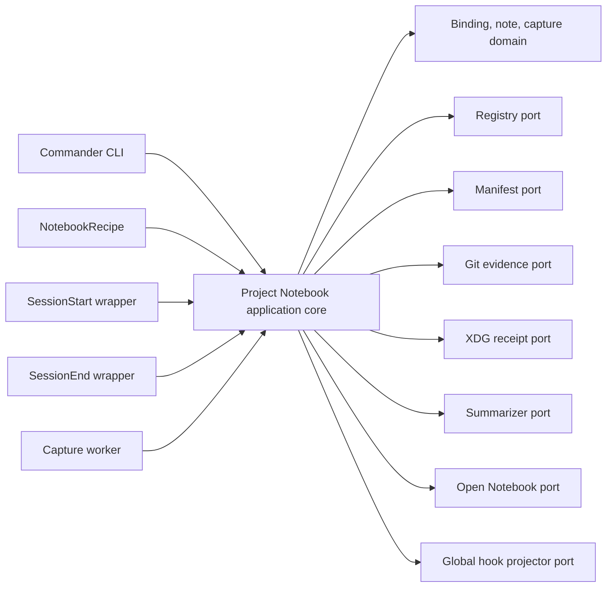
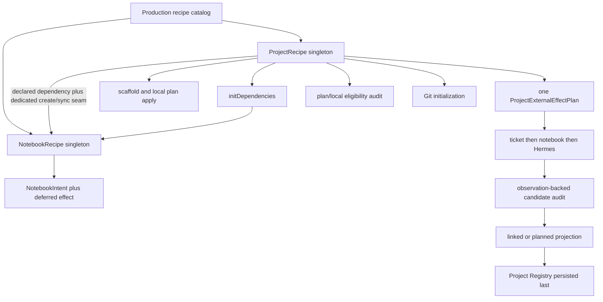
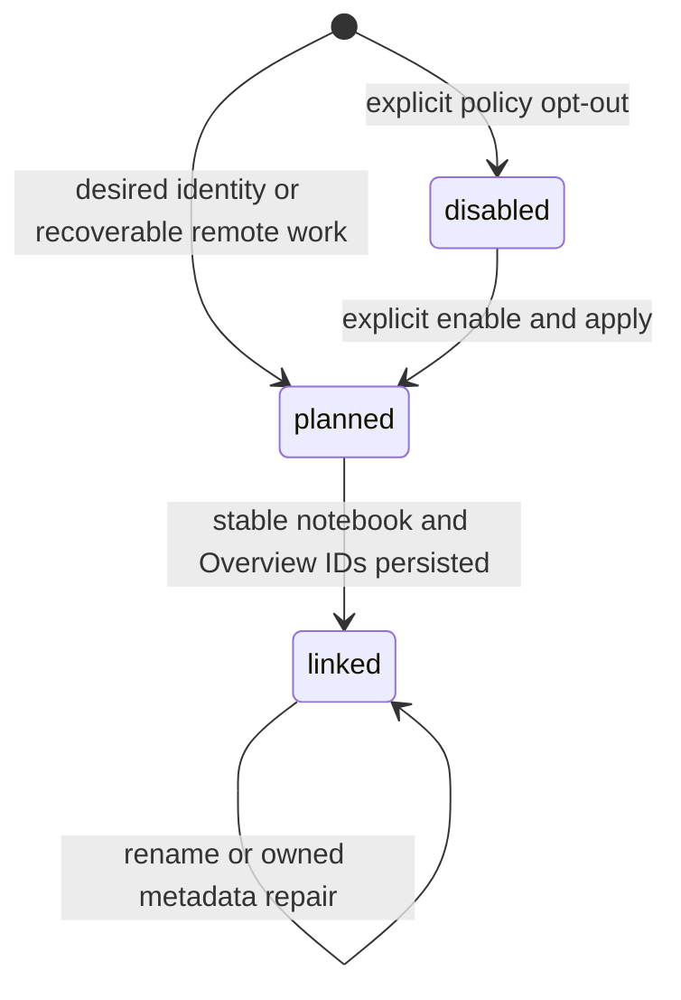
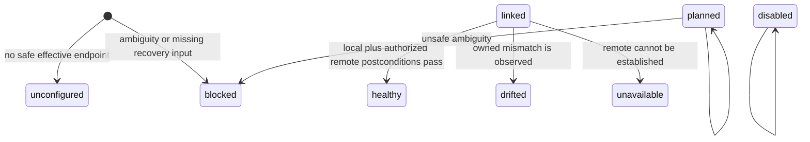
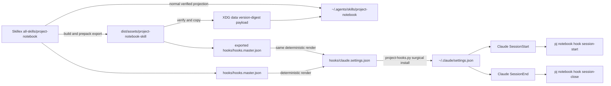
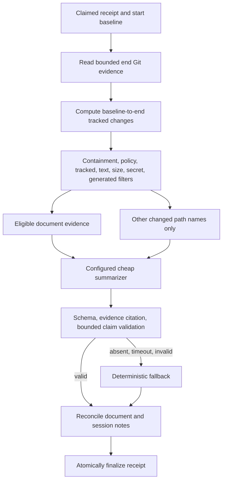

# Architecture Spine — PJangler Project Notebook

## Design Paradigm

One hexagonal Project Notebook module owns lifecycle policy and domain behavior. Commander, the singleton recipe registry, Managed Hook wrappers, and the detached capture worker are inbound adapters. Registry, Manifest, Git, XDG state, summarizer, Open Notebook, and hook projection are outbound ports. CLI and hooks may parse or render, but may not reconstruct policy, call Open Notebook directly, or implement reconciliation. `plan` is a pure domain operation; `apply` is the only mutation path.



Dependency direction is inward: inbound and outbound adapters depend on application/domain contracts; the domain depends on no adapter. Outbound adapters do not call one another. The application layer sequences them through explicit intents, observations, and outcomes.

## Invariants & Rules

### AD-1 — One lifecycle-owning module [ADOPTED]

- **Binds:** CAP-1 through CAP-8; FR-1 through FR-21
- **Prevents:** CLI, hooks, recipes, and a later MCP surface implementing different policy or remote semantics.
- **Rule:** `src/notebook/` owns all Project Notebook use cases and ports. `NotebookRecipe` is its lifecycle adapter. `src/index.ts`, hook scripts, workers, and future transports are thin adapters to the same use cases and typed outcomes.

### AD-2 — Singleton recipe registration and truthful dependency [ADOPTED]

- **Binds:** CAP-1, CAP-4; PJangler singleton recipe registry
- **Prevents:** duplicate recipe instances, hidden initialization, and Project checks running before their owner exists.
- **Rule:** The production catalog constructs exactly one `NotebookRecipe`, registers it immediately before the singleton `ProjectRecipe`, and declares `ProjectRecipe.metadata.dependencies` to include `notebook`. Because the current generic dependency dispatcher runs only on create, ProjectRecipe adds a dedicated `runNotebookLifecycle(plan, mode, context)` seam that invokes this one dependency for both create and sync/re-init without running every other create-only dependency on sync. It passes the already-built `ProjectInitPlan` and transaction context; `NotebookRecipe` never recursively invokes `ProjectRecipe`.

### AD-3 — Pure plan, explicit apply, registry last [ADOPTED]

- **Binds:** CAP-1, CAP-4, CAP-5; NFR-1, NFR-2, NFR-9
- **Prevents:** dry-run writes, false healthy state, and unrecoverable partial remote work.
- **Rule:** Planning performs no filesystem, Registry, hook-config, journal, receipt, or remote mutation. ProjectRecipe withholds every `registry.upsert` and builds one `ProjectExternalEffectPlan` ordered ticket-provider → Notebook → Hermes. Apply completes fallible local work and pre-external audit, then runs authorized effects until the first failure. A candidate remote identity is observation-audited before any linked projection; success updates the in-memory plan and Manifest, while failure keeps it planned. One Registry-only finalizer runs exactly once as the last mutation even when an external outcome makes the command unsuccessful, persisting accumulated linked results and truthful planned/blocked recovery. `externalDispatchStarted` is latched before any adapter may receive a request; fresh-target deletion is legal only while false. No remote object is auto-deleted.

### AD-4 — Four authorities plus derivative state [ADOPTED]

- **Binds:** CAP-2, CAP-6, CAP-8
- **Prevents:** bidirectional sync loops and Notebook content becoming authoritative.
- **Rule:** Git owns source documents; Project Registry owns global service defaults and Notebook Binding; `.project.json` owns per-project policy and only mirrors binding read-only; Open Notebook owns note bodies; XDG state owns mutable session baselines and receipts. Derived state is rebuilt or audited from its owner and never writes back into Git content.

### AD-5 — Lossless YAML and PostgreSQL round-trip [ADOPTED]

- **Binds:** CAP-2; FR-3, FR-10; NFR-9
- **Prevents:** re-init dropping notebook or unrelated future fields and backend-dependent behavior.
- **Rule:** Registry and Manifest schemas validate owned fields with passthrough semantics and merge owned subtrees into the parsed original document. YAML preserves unknown top-level, project, and nested keys. PostgreSQL adds typed `projects.notebook` JSONB, per-project extension JSONB, a singleton registry-settings row for global notebook config and top-level extensions, and a partial unique index on nonempty bound notebook IDs for PJangler-owned rows. Load/save and dual-write tests prove byte-stable semantics for unknown values.

### AD-6 — Stable marker reconciliation, never name identity [ADOPTED]

- **Binds:** CAP-1, CAP-3, CAP-5; FR-2, FR-4, FR-6
- **Prevents:** duplicate-name adoption, duplicate creation after timeout, and rename breaking identity.
- **Rule:** Canonical PJangler project slug is the stable project key; display name is mutable. A notebook description carries `pjangler.project.v1:<slug>`. Every notebook or note create is guarded by an atomic XDG `RemoteMutationJournalV1`: `prepared` is fsynced with kind/logical marker/input digest, `possibly-dispatched` is fsynced and latches ProjectRecipe immediately before POST, `reconciled` records a proved zero/one/many result, and `committed` records durable binding/ownership completion. Only adapter proof that no bytes were dispatched may reset a prepared/armed attempt for safe retry. Zero may create only without an unresolved possibly-dispatched attempt; one adopts by ID; many returns `CONFLICT`. An unresolved possibly-dispatched attempt may reconcile only and stays planned/blocked; it never issues a second POST.

### AD-7 — Typed, bounded Open Notebook adapter [ADOPTED]

- **Binds:** CAP-5; FR-18, FR-19; NFR-2, NFR-4, NFR-5
- **Prevents:** vendor payload leakage, hanging hooks, unsafe redirects, and retrying unsafe writes.
- **Rule:** The outbound port accepts domain IDs and returns validated domain records or normalized categories. Every call has connect/overall timeouts, abort propagation, request/response ceilings, and redirect-host rejection. Reads and proven-idempotent writes may retry finitely; create follows AD-6. Persistent config stores an explicit HTTPS hostname or loopback HTTP URL and an auth environment-variable name, never a secret value or built-in LAN/public default.

### AD-8 — Membership before access; local text search [ADOPTED]

- **Binds:** CAP-3, CAP-5; FR-7, FR-8, FR-20
- **Prevents:** cross-project reads/mutations and incomplete global search being represented as scoped search.
- **Rule:** `get`, `update`, and `delete` first list notes with `notebook_id` and prove the target ID is in that returned set; absence never triggers an unscoped get. List/search results originate only from that scoped list. Text search ranks locally with deterministic ordering and bounded excerpts. Open Notebook global text/vector search is not a source of complete v1 results: `parent_id` may prove an individual result but the global limit cannot prove completeness. Semantic search is unavailable in v1.

### AD-9 — Stable note identities and embedded envelope [ADOPTED]

- **Binds:** CAP-1, CAP-3, CAP-7, CAP-8
- **Prevents:** title-based lookup, duplicate Overview/capture/document notes, and lost provenance.
- **Rule:** Overview is addressed only by Registry `overview_note_id`. Every PJangler-created note starts with a `PjanglerNoteEnvelopeV1` marker containing base64url canonical JSON with project key, kind, logical ID, and safe provenance. Kinds are `overview`, `user-note`, `document`, and `session-capture`. Direct add generates a UUID operation ID inside its prepared journal and uses logical ID `user-note:v1:<operation-id>`; an unresolved retry with the same binding/title/content digest reuses that journal, while a committed identical later add intentionally gets a new ID. Managed update preserves kind/logical ID; an unmarked service note stays unmarked. Zero/one/many create reconciliation mirrors AD-6. Native Open Notebook Sources and uploads are not used in v1.

### AD-10 — Exact CLI and JSON v1 boundary [ADOPTED]

- **Binds:** CAP-3, CAP-4; FR-5 through FR-9, FR-21
- **Prevents:** scripts parsing prose, transport details escaping, and inconsistent exit behavior.
- **Rule:** The command grammar in this spine is the complete public v1 surface. `--json` writes one schema-version-1 envelope to stdout with no ANSI or progress; bounded diagnostics go to stderr. Empty/no-op/skip results are success. Symbolic codes are stable; numeric exits follow the mapping in this spine. Breaking fields or meanings require a major version or compatibility shim.

### AD-11 — Immutable observation feeds synchronous recipe checks [ADOPTED]

- **Binds:** CAP-1, CAP-4, CAP-5; current synchronous recipe audit contract
- **Prevents:** checks making hidden network calls and fresh-init audit failing because the Registry is not persisted yet.
- **Rule:** Async commands prepare an immutable `NotebookObservation` and attach it with `NotebookPlan` to `LifecycleContext`; checks remain synchronous and side-effect free. Fresh ProjectRecipe audits prefer plan/repo-local state and may validate remote postconditions from the observation before Registry persistence. Ordinary `pj audit` without an observation marks remote rules `skip`; `pj notebook audit` prefetches unless `--local-only`.

### AD-12 — Selected, owned migrations only [ADOPTED]

- **Binds:** CAP-4; FR-15 through FR-17
- **Prevents:** Project Notebook repair changing foreign configuration or calling global migrate-all.
- **Rule:** `pj notebook migrate` selects only the seven public `notebook.*` rules. Dry-run is pure; `--apply` authorizes owned local repairs; `--live` additionally authorizes remote repair. Generic synchronous migration blocks remote-needed rules with the exact `pj notebook migrate --apply --live` next action. A postcondition audit demotes incomplete repair to partial/blocked.

### AD-13 — One global skill hook source and surgical projector [ADOPTED]

- **Binds:** CAP-6; FR-10, FR-17; NFR-9
- **Prevents:** per-project reinjection, clobbered foreign hooks, duplicate delivery, and competing implementation homes.
- **Rule:** Canonical hand-edited source is `/home/delorenj/code/skillex/all-skills/project-notebook/`; normal Skillex projection creates `~/.agents/skills/project-notebook`, while AD-23 supplies the packed fallback. Its hook master and wrappers are the only Project Notebook hook source. Canonical commands begin exactly `PJ_HOOK_OWNER=project-notebook.v1 ` and then the event-specific projected wrapper path. Ownership is an anchored prefix predicate plus a recognized wrapper, never a substring or extra JSON property. The projector updates the earliest owned inner hook in place, removes only later owned duplicates, preserves foreign groups/siblings/order, appends when absent, and uninstalls only owned entries. Live `~/.claude/settings.json` is generated operator state, never source.

### AD-14 — True Claude session boundaries only [ADOPTED]

- **Binds:** CAP-6, CAP-7, CAP-8; FR-11, FR-12
- **Prevents:** per-turn capture, falsely claiming unsupported equivalence, and coupling to Bloodbank event semantics.
- **Rule:** MVP installs Claude Code `SessionStart` and true `SessionEnd` only. It does not bind `Stop`. Unsupported clients produce an audit `skip` and no hook. Bloodbank remains foreign and may keep its own current `Stop` mapping; CommonProject remains project-scoped foreign ownership. Current Bloodbank global `_publisher_markers`/`_merge_hooks` preservation is relied on only with a regression proving `project-notebook.v1` survives sync.

### AD-15 — Baseline precedes Overview; close deduplicates then admits [ADOPTED]

- **Binds:** CAP-7, CAP-8; FR-11 through FR-13; NFR-6
- **Prevents:** missing change boundary, repeated context, admission races, and SessionEnd exceeding its foreground budget.
- **Rule:** For an enabled project, SessionStart derives `session_key = sha256("pjangler-session-v1\0" + project_slug + "\0" + client + "\0" + client_session_id)` from the required nonempty Claude `session_id`. It exclusive-creates one complete/incomplete baseline and never overwrites it on resume. Baseline runs whenever `session_start_enabled` or `session_capture_enabled` is true; only Overview contact/emission is gated by `session_start_enabled`. Bound/deadline truncation records incomplete with reasons and later capture blocks. Both policies false does no work; missing session ID fails open. SessionEnd derives receipt/capture identity from the same session key and, under one bounded per-project admission lock, orders same-receipt dedupe → exact receiptless-baseline expiry check/prune → actual queued-candidate serialization → state-integrity proof → prospective count/byte admission. An existing same-session receipt is deduplicated without consuming new capacity or authorizing a retry. A genuinely new session is admitted only when the real serialized candidate keeps both measures within cap. A cap refusal creates no receipt, starts no worker, runs no network/Git diff/upload/summarizer work, records only bounded `RetentionRefusalV1`, says this session was not captured, emits the bounded `retention-pressure` diagnostic defined below, exits 0 within the existing 250 ms foreground deadline, and leaves the unexpired SessionStart baseline intact.

### AD-16 — Restricted atomic XDG state and preservation-safe retention [ADOPTED]

- **Binds:** CAP-7, CAP-8; NFR-4, NFR-5, NFR-7
- **Prevents:** repository pollution, partial receipts, shared-readable metadata, symlink escape, and capacity management destroying recovery evidence.
- **Rule:** State lives below `$XDG_STATE_HOME/pjangler/notebook/v1` or the platform fallback and owns baselines, claims, `RetentionRefusalV1` markers, receipts, leases, note ownership, and `RemoteMutationJournalV1` operations. Directories are mode `0700`; files are `0600`; creation uses no-follow containment checks, exclusive claims, same-directory temp, fsync, and atomic rename. Only a `succeeded` receipt whose configured `receipt_succeeded_retention_days` has elapsed may expire. Receipts in `queued`, `processing`, `failed`, `retry-exhausted`, or `blocked-missing-baseline` are unresolved and are never automatically deleted or silently compacted; v1 has no dismissal transition or command. Invalid, unreadable, or non-regular receipt entries are preserved and take the separate `state-integrity` admission path; they are never mislabeled as retention pressure. Existing unresolved receipt transitions may grow only within the per-receipt ceiling and are never blocked or truncated to satisfy aggregate caps; count and byte caps govern new SessionEnd admission instead. A baseline/Overview claim referenced by any unresolved receipt or mutation journal is equally preserved regardless of age. Baselines/claims and refusal markers with no receipt or journal reference share the finite `receiptless_session_retention_seconds` lifecycle and may be pruned only after that grace; this cleanup is not receipt expiry or dismissal. Unresolved mutation journals likewise remain visible until committed or operator-resolved. State contains hashes, safe paths, IDs, counters, categories, and bounded diagnostics—never credentials or document bodies.

### AD-17 — Deterministic receipt and explicitly authorized retry state machine [ADOPTED]

- **Binds:** CAP-8; FR-12 through FR-14; NFR-2, NFR-4, NFR-7, NFR-9
- **Prevents:** duplicate captures, abandoned processing, unbounded retries, a direct retry starting a hidden loop, and shell injection.
- **Rule:** Receipt ID is lowercase-hex SHA-256 over the UTF-8 bytes of `"pjangler-receipt-v1\0" + session_key`; Session Capture logical ID is lowercase-hex SHA-256 over the UTF-8 bytes of `"pjangler-capture-v1\0" + session_key`. No JSON framing or decoded-hash bytes are substituted. Receipt states are exactly `queued`, `processing`, `succeeded`, `failed`, `retry-exhausted`, and `blocked-missing-baseline`; `retention-pressure` is a computed diagnostic/finding, never a seventh state. A worker claims by compare-and-swap lease. The initial attempt plus configured finite automatic retries is bounded. One operator invocation of `pj notebook capture retry` on a `failed` or `retry-exhausted` receipt atomically reuses that same receipt and grants exactly one further attempt; if it fails, the receipt returns directly to `retry-exhausted` with no automatically scheduled loop. Retrying `blocked-missing-baseline` reuses the same receipt and requires a validated explicit `--baseline GIT_REF`; without it, no transition occurs. Spawn uses `process.execPath`, an argv array, `shell:false`, ignored stdio, detached/unref, and receipt ID only.

### AD-18 — Git-evidenced eligible documents [ADOPTED]

- **Binds:** CAP-8; FR-13; NFR-3 through NFR-5
- **Prevents:** mtime guesses, source-code dumping, secret exfiltration, path escape, and unchanged duplicate notes.
- **Rule:** Eligibility derives from baseline/end Git evidence and policy. Default candidates are tracked `**/*.md` and `**/*.mdx`. Ignored, untracked-by-default, generated, binary, symlink-escaping, secret-like, oversized, disallowed, and unchanged content is excluded before summarization or service calls with bounded reason codes. Each derivative records repository-relative path, source revision or SHA-256 digest, AD-15's lowercase-hex `session_key`, capture time, and policy version—never the raw client session ID.

### AD-19 — Optional bounded summarizer with deterministic fallback [ADOPTED]

- **Binds:** CAP-8; FR-14; NFR-3, NFR-4
- **Prevents:** capture depending on a model, unsupported success claims, and prompt/command injection.
- **Rule:** A configured cheap summarizer is an argv-based port with no shell and receives only bounded, filtered evidence. Its structured result must cite evidence items and pass schema/claim checks; timeout, absence, error, or invalid output selects the deterministic fallback. Fallback sections are changed eligible documents, other changed path names, verification evidence, unresolved/uncommitted work, and an explicit insufficient-evidence statement.

### AD-20 — Authorization is literal and operation-scoped [ADOPTED]

- **Binds:** CAP-1, CAP-3, CAP-4, CAP-7, CAP-8; NFR-1
- **Prevents:** one flag silently authorizing unrelated remote changes.
- **Rule:** Direct read invocation authorizes that read unless `--local-only`; direct add/update/overview replacement authorizes only that mutation; delete additionally requires interactive confirmation or `--yes`. One direct `capture retry` invocation authorizes exactly one attempt on that existing receipt and no other receipt or automatic loop; `blocked-missing-baseline` additionally requires an explicit valid `--baseline GIT_REF`. Composite init/create/migrate remote mutation requires `--live`. Managed Hooks require durable Manifest policy shown during plan/apply. Explicit disable wins over every lower-precedence enable.

### AD-21 — Incremental rollout and non-destructive rollback [ADOPTED]

- **Binds:** CAP-1 through CAP-8; NFR-8, NFR-9
- **Prevents:** migrating all repositories at once, deleting remote knowledge during rollback, and hook managers fighting.
- **Rule:** Ship schema/adapter, then local CLI, then one canary binding, then global skill/hooks, then capture worker, then opt-in migration. Rollback disables per-project policies, removes only `project-notebook.v1` hook entries, and may remove local bindings/projections only through owned migration; it never deletes notebooks, notes, foreign hooks, or authoritative Git content.

### AD-22 — Isolated evidence is the release gate [ADOPTED]

- **Binds:** CAP-1 through CAP-8; NFR-10 and all success measures
- **Prevents:** passing mocks that miss packaged CLI, backend, fanout, or cross-project failures.
- **Rule:** Unit, adapter contract, generated-project, both Registry backend, packed CLI with developer checkouts unavailable, hook coexistence, remote-journal crash points, receipt restart, policy matrix, Overview Drift, JSON/search fixtures, security, and adversarial isolation suites must pass without production data. A read-only live reconnaissance check may confirm compatibility but never replaces contract fixtures or mutates operator notebooks.

### AD-23 — Canonical source, digest-verified packed skill export [ADOPTED]

- **Binds:** CAP-6; packaged CLI acceptance; `notebook.skill-installed`
- **Prevents:** a tarball requiring one developer's absolute Skillex checkout or creating a second hand-edited skill source.
- **Rule:** Skillex remains the only hand-edited source. PJangler build/prepack generates `dist/assets/project-notebook-skill/` plus `export-manifest.json` and `SHA256SUMS`, rejects symlinks/unsafe files, and ships it through the existing `dist` package inclusion. Runtime source precedence is validated `PJ_PROJECT_NOTEBOOK_SKILL_ROOT` → validated `PJ_SKILLS_REGISTRY_ROOT/all-skills/project-notebook` → package-relative export. Install copies a resolved immutable payload to `$XDG_DATA_HOME/pjangler/skills/project-notebook/<version>-<digest>` and owns only a matching `~/.agents/skills/project-notebook` link; a foreign/custom path conflicts rather than being overwritten. If no verified source exists, audit fails with reinstall/build next action and no partial hooks.

## Consistency Conventions

| Concern | Convention |
| --- | --- |
| Domain names | Types are `NotebookBinding`, `NotebookPolicy`, `NotebookIntent`, `NotebookObservation`, `NotebookOutcome`, `CaptureReceiptV1`, and `PjanglerNoteEnvelopeV1`; files are lower kebab-case. |
| Recipe/rule IDs | Recipe ID is `notebook`; public checks are `notebook.configuration`, `notebook.binding`, `notebook.remote-notebook`, `notebook.overview-note`, `notebook.skill-installed`, `notebook.hooks-projected`, and `notebook.capture-receipts`. IDs never change after release. |
| Stable identity | Project key is canonical persisted slug; remote notebook/note IDs are opaque strings. Logical note and receipt IDs are lowercase SHA-256 hex over canonical UTF-8 fields with an explicit v1 prefix. Display names and titles are never identity. |
| Time | UTC RFC 3339 with `Z`; elapsed deadlines use a monotonic clock. Service timestamps are parsed but not trusted for ordering or idempotency. |
| Ordering | Notes list: `updated_at` descending then ID ascending. Local search: score descending, `updated_at` descending, ID ascending. Receipts: created time descending then receipt ID ascending. |
| Pagination | Cursor is opaque base64url canonical JSON carrying schema version and the last sort tuple; malformed or mismatched cursors return `INVALID_INPUT`. Limits pass through one bounded `NotebookLimitsV1` policy. |
| Config precedence | Built-in safe defaults → global Registry defaults → Manifest policy → explicit invocation option. Explicit disable wins for hooks. Service URL/auth never come from Manifest. |
| Mutation | Use compare-current-then-atomic-replace locally; use stable-marker reconcile remotely. Repeated logical work is no-op, update-in-place, or an explicit conflict—never a blind duplicate. |
| Errors | Domain `NotebookError` has `code`, safe message, retryable flag, bounded details, and next actions; adapter causes are retained without response bodies, credentials, or absolute secret paths. |
| JSON | One UTF-8 schema-v1 object plus newline on stdout. `notebook` separates `binding_state` from computed nullable `health`; each command uses the data schema below. Field order is stable for fixtures; additive fields are compatible. No ANSI, progress, undefined, or raw vendor payload. |
| Logging | Operation, project slug, binding state, outcome, retryability, exclusions, and next action only. Auth values, note bodies, transcript bodies, response bodies, and candidate secret text are forbidden. |
| Network | Persistent `base_url` has no built-in default. Allow HTTPS configured hostnames and HTTP loopback only; reject userinfo, query/fragment, non-HTTP schemes, redirects to a different origin, and numeric non-loopback hosts. |
| Hook ownership | Owned commands match anchored prefix `PJ_HOOK_OWNER=project-notebook.v1 ` plus a recognized event wrapper; generated order follows master order. Project Notebook never edits `Stop` or any nonmatching entry. |
| Limits | All request, response, excerpt, diff, prompt, note, file, list, retry, timeout, concurrency, and retention ceilings are finite fields of `NotebookLimitsV1`. It contains finite positive `receipt_succeeded_retention_days`, `receiptless_session_retention_seconds`, `unresolved_receipt_max_count`, `unresolved_receipt_max_bytes`, and a per-receipt byte ceiling shared by hooks, workers, status, and audit. Contractual defaults include Overview 4,000 characters; other calibrated values live in one versioned policy, not scattered constants. |

## Stack

Verified at authoring; code and lockfiles own upgrades after implementation.

| Name | Version |
| --- | --- |
| Node.js runtime | 26.5.0, package contract >=20 |
| TypeScript | 5.9.3 |
| Commander | 14.0.3 |
| Zod | 4.4.3 |
| YAML | 2.9.0 |
| node-postgres | 8.22.0 |
| node-pg-migrate | 8.0.4 |
| esbuild | 0.25.12 |
| Open Notebook adapter contract | 1.14.0 reconnaissance baseline |
| Open Notebook deployment image | v1-latest@sha256:e53f2f4fe26b6c00fd234dfa1cfbbd798f103f642017a9b490efe7fd689ea0d7 |
| Project Notebook JSON/receipt/note envelope | 1 |

## Structural Seed

### Component and file ownership

```text
pjangler/
  src/notebook/
    types.ts                    # domain types, schemas, errors, limits
    config.ts                   # precedence, URL/auth-name validation, provenance
    module.ts                   # use cases and port orchestration
    open-notebook-client.ts     # sole HTTP adapter
    reconcile.ts                # marker and ambiguity reconciliation
    remote-mutation-journal.ts  # crash-safe create dispatch/reconcile journal
    notes.ts                    # scoped CRUD, local text search, envelopes
    overview.ts                 # OverviewDescriptor compiler and Drift proof
    checks.ts                   # seven recipe-owned synchronous checks
    migration.ts                # selected owned repairs and postconditions
    observation.ts              # async prefetch for sync audit contract
    hooks.ts                    # skill/projector audit and invocation port
    state.ts                    # atomic XDG baselines, admission, receipts, leases, retention
    capture.ts                  # worker orchestration and derivative upsert
    git-evidence.ts             # baseline/end Git evidence and eligibility
    summarizer.ts               # configured argv adapter and fallback
    output.ts                   # JSON v1/human render and exit map
    cli.ts                      # Commander registration only
  src/recipes/NotebookRecipe.ts # singleton lifecycle adapter
  src/recipes/catalog.ts        # register NotebookRecipe before ProjectRecipe
  src/recipes/ProjectRecipe.ts  # deferred notebook external tail, registry last
  src/recipes/types.ts          # NotebookPlan/Observation context extension
  src/project/index.ts          # lossless Registry/Manifest notebook schemas
  src/project/RegistryStore.ts  # YAML/PG notebook and extension round-trip
  src/index.ts                  # thin public command attachment
  src/describe/index.ts         # notebook status summary only
  scripts/export-project-notebook-skill.mjs
                                # verified Skillex source -> dist package export
  package.json                  # prepack export and existing dist inclusion
  migrations/
    0xx-project-notebook-registry.cjs
  tests/
    pjan-77-notebook-domain-regressions.ts
    pjan-77-notebook-adapter-contract.ts
    pjan-77-notebook-lifecycle-regressions.ts
    pjan-77-notebook-cli-contract.ts
    pjan-77-notebook-hooks-capture.ts
    pjan-77-notebook-security-isolation.ts
    fixtures/open-notebook-v1/

skillex/
  all-skills/project-notebook/
    SKILL.md                     # canonical operator/agent surface
    agents/openai.yaml
    hooks/hooks.master.json      # hand-edited Project Notebook hook SSOT
    hooks/claude.settings.json   # deterministic generated fragment
    hooks/session-start.sh       # thin wrapper to pj internal hook command
    hooks/session-end.sh         # thin wrapper to pj internal hook command
    scripts/project-hooks.py     # check/render/install/uninstall projector
    references/configuration.md
    references/recovery.md
    tests/test_project_hooks.py

bloodbank/
  services/agent-hooks/sync.py  # foreign existing global projector; no notebook logic
  services/agent-hooks/tests/test_sync_coexistence.py
                                # new fixture proving project-notebook.v1 survives sync

operator state, never source:
  ~/.agents/skills/project-notebook -> canonical Skillex skill
  ~/.claude/settings.json           # merged global hook target
  $XDG_STATE_HOME/pjangler/notebook/v1/
```

Repository ownership is exact: PJangler owns module, lifecycle, Registry/Manifest, CLI, and receipt logic; Skillex owns the global skill package and its projector; Bloodbank owns only its existing global fanout plus the coexistence regression; CommonProject owns project `.claude/settings.json` and receives no Project Notebook entries; the operator owns live settings and notebooks.

### Dependency and lifecycle placement



`runNotebookLifecycle` invokes `NotebookRecipe` during both create and sync/re-init; it may reconcile owned local policy, skill, and hook projection and return a deferred remote intent. It does not perform remote mutation before ProjectRecipe's external boundary and does not awaken unrelated create-only dependencies during sync. Direct `pj notebook` commands call the same application use cases without constructing a second recipe.

### Registry and Manifest contract

The Project Registry top level adds `notebook` global configuration and each project adds `notebook` binding. Service URL is required before remote work; on this verified host an operator may configure `http://127.0.0.1:8502`, but that reconnaissance value is not compiled as a default. The public OIDC URL is interactive and is not the unattended machine endpoint. `auth.env_var` may be `OPEN_NOTEBOOK_PASSWORD`; its value is read only at call time and, while live auth reports disabled, no Authorization header is sent. Effective global policy also resolves finite positive `receipt_succeeded_retention_days`, `receiptless_session_retention_seconds`, `unresolved_receipt_max_count`, and `unresolved_receipt_max_bytes` from the one versioned `NotebookLimitsV1` source; global overrides may tighten them, but hooks, workers, status, and audit may not select private defaults. These state limits are not Manifest binding fields and no secret-bearing value participates in them.

```yaml
schema_version: 1
notebook:
  base_url: https://configured-automation-host.example
  auth:
    mode: environment
    env_var: OPEN_NOTEBOOK_PASSWORD
  defaults:
    enabled: true
    overview_max_chars: 4000
    session_start_enabled: true
    session_capture_enabled: true
    documentation_globs:
      - "**/*.md"
      - "**/*.mdx"
projects:
  example:
    notebook:
      state: linked
      notebook_id: opaque-notebook-id
      notebook_name: example
      overview_note_id: opaque-note-id
```

`.project.json` adds only an owned `notebook` subtree. `binding` mirrors Registry values and is never accepted as authority for an existing registered project. `policy` contains repository overrides and no endpoint/auth material.

```json
{
  "notebook": {
    "binding": {
      "state": "linked",
      "notebook_id": "opaque-notebook-id",
      "notebook_name": "example",
      "overview_note_id": "opaque-note-id"
    },
    "policy": {
      "enabled": true,
      "session_start_enabled": true,
      "session_capture_enabled": true,
      "overview_max_chars": 4000,
      "documentation_globs": ["**/*.md", "**/*.mdx"]
    }
  }
}
```

For fresh init before Registry persistence, the in-memory `NotebookPlan` is provisional authority and the Manifest planned projection is recovery evidence. Once a Registry record exists, any projection mismatch is Drift and migration projects Registry → Manifest; Manifest never silently overwrites Registry binding.

PostgreSQL migration adds:

```sql
ALTER TABLE public.projects
  ADD COLUMN notebook jsonb NOT NULL DEFAULT '{}'::jsonb,
  ADD COLUMN pjangler_extensions jsonb NOT NULL DEFAULT '{}'::jsonb;

CREATE TABLE public.pjangler_registry_settings (
  scope text PRIMARY KEY,
  schema_version integer NOT NULL,
  notebook jsonb NOT NULL DEFAULT '{}'::jsonb,
  extensions jsonb NOT NULL DEFAULT '{}'::jsonb,
  CHECK (scope = 'global')
);

CREATE UNIQUE INDEX projects_notebook_id_unique
  ON public.projects ((notebook->>'notebook_id'))
  WHERE slug IS NOT NULL AND COALESCE(notebook->>'notebook_id', '') <> '';
```

Representation is path-preserving. Global `notebook` and each `projects.<slug>.notebook` store their complete subtrees, including unknown descendants. `pjangler_extensions` contains only unknown sibling keys at the project-record top level; the singleton `extensions` contains only unknown Registry top-level siblings. On load, extensions merge first and validated fields overlay only their exact owned paths. Existing `slug IS NULL` rows remain untouched.

YAML uses `YAML.parseDocument` and mutates exact owned CST paths; regression snapshots require bytes outside changed node spans—including comments, scalar style, key order, and unknown nodes—to remain identical. PostgreSQL JSONB tests compare semantic JSON values because byte formatting is not defined. Manifest mutation parses the original JSON object and replaces only `notebook.binding` plus explicitly changed policy keys; every unknown sibling/descendant survives. YAML remains authoritative in current dual-write mode; PG failure is observable and never causes YAML data loss.

### Open Notebook v1.14 adapter boundary

The verified host proxy is `/api/*` at the configured loopback origin; OpenAPI is exposed internally on port 5055. The adapter normalizes these current facts without leaking them into domain callers:

| Operation | Verified service shape | Domain constraint |
| --- | --- | --- |
| health/version | `GET /api/config`; version 1.14.0 observed | Validate bounded version/health shape; this response is not auth authority. |
| auth status | separate deployment auth-status response; live `auth_enabled:false` observed | Treat status as deployment provenance; configured auth and actual 401/403 normalize independently. |
| list notebooks | `GET /api/notebooks` → `NotebookResponse[]` | Match exact description marker, not name. Names are nonunique. |
| create notebook | `POST /api/notebooks` with name and optional description | No caller idempotency key; use AD-6 uncertainty rules. |
| update notebook | `PUT /api/notebooks/:id` with name/description/archived | Stable ID remains identity; marker must survive update. |
| list notes | `GET /api/notes?notebook_id=...` → `NoteResponse[]` | This filtered response is the membership proof. NoteResponse has no notebook ID. |
| note CRUD | note ID endpoints | Get/update/delete are unavailable until the scoped list proves membership. Overview delete is always blocked. |
| search | `POST /api/search`; type text/vector, limit 1..1000 | Global only. `parent_id` can prove one result, not complete isolation; public v1 search does not use it. |

The port is binding-aware rather than raw REST-shaped: `listNotes(binding)`, `getOwnedNote(binding,id)`, `createNote(binding,input)`, `updateOwnedNote(binding,id,input)`, and `deleteOwnedNote(binding,id)`. There is no exported unscoped `getNote(id)` or `deleteNote(id)`. A target absent from the scoped list returns `CROSS_PROJECT` only when Registry/receipt ownership proves another binding; otherwise it returns `NOT_FOUND`, without probing the foreign object.

Notebook and note create outcomes distinguish `pre-dispatch` from `possibly-dispatched` through AD-6's journal. The adapter may classify pre-dispatch only with transport proof that no request bytes left the process. Otherwise the journal remains possibly-dispatched and enters bounded reconciliation. If unresolved, status is `planned/blocked`; subsequent automatic calls reconcile only. Health/version and auth status are separate probes: bearer credentials are sent only when effective PJangler auth config requires them, and an actual 401/403 is `AUTHENTICATION_FAILED` regardless of `/api/config`.

### Note model and local search

The first line of managed note content is a marker whose payload is canonical JSON encoded base64url. It is parsed under strict size and schema limits and stripped from human excerpts.

```text
<!-- pjangler-note-v1:BASE64URL_CANONICAL_JSON -->
```

Envelope fields are `schema_version`, `project_slug`, `kind`, `logical_id`, `source_path`, `source_revision`, `content_sha256`, `session_key`, `captured_at`, `policy_version`, and optional `overview_descriptor`; fields not applicable to a kind are absent. Kinds are exactly `overview`, `user-note`, `document`, and `session-capture`.

- Overview logical ID is `overview:v1:<project-slug>` and its persisted service note ID is authoritative.
- User-note logical ID is `user-note:v1:<operation-id>` from the prepared RemoteMutationJournal. Two identical adds after the first commits are distinct operations; an unresolved retry reuses the active journal selected by binding plus title/content digest.
- Document logical ID is SHA-256 of version, project slug, and normalized repository-relative path; a changed digest updates the same note.
- Session Capture logical ID is the AD-17 digest derived from the one session key; a retry updates/no-ops the same note.
- A matching logical ID found more than once is `CONFLICT`; automation never chooses one.
- Updating a managed note must preserve its first-line envelope and logical identity. Updating a scoped manual/unmarked service note is permitted but must remain unmarked; the client never forges PJangler ownership after creation.

Local text search normalizes title, body-after-marker, and query with NFKC then Unicode lowercase and tokenizes with `/[\p{L}\p{N}]+/gu`. Every distinct query token is required. Score is `10 × exact-token title occurrences + exact-token body occurrences`; ties use the global ordering convention, and the excerpt starts at the first body token match. It consumes only a complete scoped list accepted under response/count ceilings. An incomplete/failed list returns its `THROTTLED`, `TIMEOUT`, `SERVICE_UNAVAILABLE`, or `REMOTE_PROTOCOL_ERROR`; only a complete list may return empty/`NOT_FOUND`/`CROSS_PROJECT`. Vector/semantic search has no v1 command or fallback because the upstream global 1,000-result ceiling cannot prove completeness.

### Overview seed and Drift proof

`OverviewDescriptorV1` is compiled when the stable Overview note is created or replaced. It contains schema version, project slug/name, a purpose value or the literal visible placeholder `Purpose not yet documented`, ordered normalized repository-relative authoritative references, each reference's Git revision/content SHA-256, and compiler policy version. Default references are existing tracked files from `.project.json`, `README.md`, `AGENTS.md`, `CLAUDE.md`, and `docs/architecture.md`; Manifest policy may supply a contained ordered `overview_references` list. Missing references are recorded, never guessed, and no absolute path enters the note.

SessionStart records the baseline first, then recomputes descriptor reference digests under Git/containment/size bounds before emitting remote content. A difference sets computed health `drifted` and emits a bounded `PROJECT NOTEBOOK OVERVIEW DRIFT` warning with relative paths/reasons before the stored Overview, which is labeled stale; it is never presented silently as current. `notebook.overview-note` audit performs the same comparison. Owned live migration recompiles and updates the existing Overview note in place, preserving `overview_note_id`.

### Public CLI grammar

```text
pj notebook status [repo] [--local-only] [--json]
pj notebook create [repo] --live [--json]
pj notebook list notes [repo] [--limit N] [--cursor VALUE] [--json]
pj notebook add note [repo] --title TEXT (--text TEXT | --file PATH) [--json]
pj notebook get note NOTE_ID [repo] [--json]
pj notebook update note NOTE_ID [repo] [--title TEXT] (--text TEXT | --file PATH) [--json]
pj notebook delete note NOTE_ID [repo] [--yes] [--json]
pj notebook search notes QUERY [repo] [--limit N] [--json]
pj notebook overview [repo] [--set-file PATH] [--json]
pj notebook capture list [repo] [--state VALUE] [--json]
pj notebook capture retry RECEIPT_ID [repo] [--baseline GIT_REF] [--json]
pj notebook audit [repo] [--local-only] [--json]
pj notebook migrate [repo] [--apply] [--live] [--json]
```

Internal compatibility surfaces, not public user commands:

```text
pj notebook hook session-start --payload-file PATH
pj notebook hook session-close --payload-file PATH
pj notebook worker capture --receipt-id ID
```

Hook payload normally arrives on stdin; a payload file must be a contained mode-0600 XDG state file. User-controlled content and secrets never appear in argv. `create` retains `--live` because it is a composite reconcile/provision operation; direct note mutation is authorized by selecting that one command. `overview` without `--set-file` reads; with it, it updates the stable note in place. Delete rejects Overview and requires confirmation/`--yes` before any request.

### JSON v1 and exit mapping

```json
{
  "schema_version": 1,
  "ok": true,
  "command": "notebook.notes.list",
  "project": {"slug": "example", "repo_path": "/canonical/path"},
  "notebook": {
    "binding_state": "linked",
    "health": "healthy",
    "id": "opaque-notebook-id",
    "name": "example"
  },
  "data": {"items": [], "next_cursor": null},
  "error": null,
  "next_actions": []
}
```

`notebook.health` is `unconfigured|healthy|drifted|unavailable|blocked|null`; null means not observed, including local-only. `NoteSummaryV1` is `{id,title,note_type,created_at,updated_at,excerpt}`; `NoteDetailV1` replaces excerpt with bounded `content`; `CaptureReceiptSummaryV1` exposes IDs, one of the exact six receipt states, times, automatic/manual attempt counts, current attempt origin, categories, and serialized byte count, but no stored body. `RetentionRefusalSummaryV1` is `{outcome,session_key,refused_at,reason,current_count,current_bytes,candidate_bytes,max_count,max_bytes,next_actions}`, where `outcome` is exactly informational `capture-refused-history`, reason is the refusal-time `count-cap|byte-cap|both`, the session key is already hashed, and actions use the exact capture-list/retry grammar. `CaptureAdmissionSummaryV1` is `{unresolved_count,unresolved_count_lower_bound,unresolved_bytes,unresolved_bytes_lower_bound,unmeasurable_entry_count,integrity_entries,receipt_caps,receiptless_session_count,stale_receiptless_session_count,active_refusals}`. Exact count/bytes are integers only when measurement is complete and otherwise null; lower bounds remain numeric. `integrity_entries` is a bounded list of `{entry_id,reason}` using safe relative/digested identifiers, never bodies or absolute paths. Status/audit do not synthesize a candidate, expose `next_receipt_bytes`, or predict an admission boolean; only a real SessionEnd serializes a candidate. Every handler validates its exact output schema before serialization:

| Command value | `data` schema |
| --- | --- |
| `notebook.status` | `{policy, configuration_provenance, remote_check, unresolved_receipt_count, unresolved_receipt_bytes, receipt_caps:{max_count,max_bytes}, capture_admission: CaptureAdmissionSummaryV1, findings}`; existing count/bytes fields mirror the nullable exact summary fields |
| `notebook.create` | `{created, adopted, notebook_id, overview_note_id}` |
| `notebook.notes.list` | `{items: NoteSummaryV1[], next_cursor: string|null}` |
| `notebook.notes.search` | `{items: NoteSummaryV1[], next_cursor: null, query_tokens}` |
| `notebook.notes.add`, `.get`, `.update` | `{note: NoteDetailV1}` |
| `notebook.notes.delete` | object with `deleted_id: string` |
| `notebook.overview.get`, `.set` | `{note: NoteDetailV1, updated, drift}` |
| `notebook.capture.list` | `{items: CaptureReceiptSummaryV1[], next_cursor: string|null}` |
| `notebook.capture.retry` | `{receipt: CaptureReceiptSummaryV1}` |
| `notebook.audit` | `{rules, audited_at, remote_check, capture_admission: CaptureAdmissionSummaryV1}` |
| `notebook.migrate` | `{dry_run, selected_rules, results, changed_files}` |

On failure `data` is null and `error` is exactly `{code,message,retryable,details}` with bounded safe strings; corrective commands remain in envelope `next_actions`. Outcome precedence is input/confirmation → safe configuration/auth resolution → scoped-list/service/protocol result → membership classification from a complete list → mutation result. Thus a timed-out membership list is `TIMEOUT`, never `NOT_FOUND`; a malformed list is `REMOTE_PROTOCOL_ERROR`, never `CROSS_PROJECT`.

| Exit | Symbolic codes | Meaning |
| --- | --- | --- |
| 0 | none | Success, empty result, no-op, local-only remote skip, or hook fail-open. |
| 1 | legacy/unclassified | Compatibility fallback only; new domain paths must not emit it. |
| 2 | `INVALID_INPUT` | Grammar, validation, cursor, confirmation, unsupported semantic request. |
| 3 | `NOT_CONFIGURED`, `AUTHENTICATION_FAILED` | Missing safe config or rejected runtime auth. |
| 4 | `NOT_FOUND`, `CONFLICT`, `CROSS_PROJECT`, `DRIFT_DETECTED` | Stable state/object conflict or isolation refusal. |
| 5 | `THROTTLED`, `TIMEOUT`, `SERVICE_UNAVAILABLE` | Retryable bounded service condition. |
| 6 | `REMOTE_PROTOCOL_ERROR`, `INTERNAL_ERROR` | Invalid bounded response or invariant failure. |

Hooks translate every integration failure into a bounded diagnostic and exit 0 after persisting only safe state. A measured cap refusal is not an error envelope and produces no receipt: stderr uses the exact bounded shape `retention-pressure: this session was not captured; unresolved count=C/MAX_C bytes=B/MAX_B candidate_bytes=N reason=R; run pj notebook capture list REPO, then pj notebook capture retry RECEIPT_ID REPO (add --baseline GIT_REF for blocked-missing-baseline)`. The same values/actions are stored in bounded `RetentionRefusalV1`. Status/audit emit finding code `retention-pressure` only from complete current usage that is itself at/over a cap or for an active marker whose real `current_count + 1` or `current_bytes + marker.candidate_bytes` still exceeds the current caps. A marker that now fits both caps remains only in `active_refusals` with informational outcome `capture-refused-history`, timestamp, and recovery actions: that session was not captured and replay may now admit it before grace expiry. `capture-refused-history` is neither a finding nor a receipt/state.

If any entry prevents exact count/byte proof, `state-integrity` takes precedence over cap evaluation: no `retention-pressure` finding or refusal marker is emitted, no receipt/worker/slow-work port is created or called, and the hook exits 0 with `state-integrity: this session was not captured; unresolved bytes>=B exact=unknown unmeasurable=U entries=IDS; run pj notebook audit REPO --local-only --json, repair the reported entry in place without deleting it, then rerun pj notebook audit REPO --local-only --json`. Status and audit use the identical nullable/lower-bound fields and safe entry reasons; `notebook.capture-receipts` is `fail`, not `warn`, until exact measurement is restored. Explicit CLI commands retain categorized nonzero exits. `--local-only` forbids adapter construction/contact, sets `remote_check` to `skip`, and emits `health:null`; it never reports `healthy` from local state alone.

### Binding and observation state

Persisted Registry binding states and computed status are deliberately separate:





`healthy` is never persisted. Without remote authorization/observation, `linked` remains linked and the remote check is skip. An explicit remote failure computes unavailable; an owned mismatch computes drifted; multi-match or unsafe recovery computes blocked.

`NotebookObservation` is immutable and contains fetch time, binding used, auth/config provenance without values, categorized health, notebook metadata, scoped note metadata/digests, Overview result, and finite diagnostics. It never contains credentials or unbounded bodies. Sources are:

| Call path | Observation behavior |
| --- | --- |
| `pj notebook audit` | Prefetch remote state, then audit only `notebook`; `--local-only` installs an explicit skip observation. |
| ordinary `pj audit` | No hidden network; remote rules skip unless caller already supplied observation. |
| fresh `pj init` | `NotebookPlan` supplies provisional binding; eligibility checks tolerate absent Registry; authorized external tail refreshes observation before pre-persist postcondition audit. |
| `pj notebook migrate` | Async orchestrator observes, selects owned rules, applies local/live gates, re-observes, then runs synchronous postcondition checks. |

### Apply transaction and recovery

```mermaid
sequenceDiagram
  participant U as Operator
  participant P as ProjectRecipe
  participant N as NotebookRecipe/module
  participant G as Git/Manifest/hooks
  participant E as ProjectExternalEffectPlan
  participant O as Remote adapters
  participant R as Project Registry
  U->>P: init plan
  P->>N: pure NotebookPlan
  N-->>P: local actions and typed Notebook effect
  P->>E: collect ticket, Notebook, Hermes in fixed order; withhold Registry
  P-->>U: complete plan including Live Actions
  U->>P: apply, optional live grant
  P->>G: scaffold, planned policy/projection, skill/hook projection
  P->>N: runNotebookLifecycle for create or sync
  P->>P: eligibility audit using plan/local state
  P->>G: initialize/verify Git
  alt live authorized
    P->>E: execute effects until first failure
    E->>O: latch dispatch, journal, invoke adapter
    O-->>E: outcomes and candidate IDs
    E-->>P: accumulated typed outcomes
    P->>P: observation-audit Notebook candidate IDs
    alt Notebook postconditions pass
      P->>G: atomically project linked binding and scoped commit
    else Notebook failed, ambiguous, or unobserved
      P->>G: retain planned projection and recovery action
    end
  else live not authorized or recoverable failure
    P->>G: retain planned projection and next action
  end
  P->>R: one Registry-only finalizer, always last mutation
  R-->>P: linked/planned recovery persisted or finalizer failed
  P->>P: final read-only audit
  P-->>U: categorized result
```

`ProjectExternalEffectPlan` is a typed list ordered ticket-provider → Notebook → Hermes; each effect returns outcome plus in-memory plan patch and never persists Registry. ProjectRecipe stops after the first failed/blocked effect, retains the primary categorized outcome, applies safe Manifest recovery, and then calls the Registry-only finalizer exactly once. A Notebook candidate becomes linked only after its notebook marker, scoped Overview membership/envelope, and owned metadata pass observation-backed checks. A failed candidate stays planned in both Manifest and Registry.

Fresh scaffolds commit the planned local baseline before remote effects. If remote success changes `.project.json`, ProjectRecipe makes a second narrowly scoped binding commit before Registry persistence; existing repositories and explicit migration never auto-commit user work. Registry persistence is the last mutation even when it persists recovery and the command then exits unsuccessfully. Final read-only audit/log rendering may follow. The existing fresh-target recursive removal branch is guarded by `externalDispatchStarted === false`; the flag latches before every ticket, Notebook, or Hermes adapter dispatch and never resets during that transaction.

| Failure point | Durable result | Rollback/retry rule |
| --- | --- | --- |
| pure plan | no writes | Safe to repeat. |
| local scaffold before dispatch latch | no remote journal armed | A newly-created target may roll back owned repo changes; global skill/hooks are never removed if other projects may use them. |
| hook/skill projection | planned local state, categorized failure | No remote work begins; rerun projector idempotently. |
| transport proves no bytes dispatched | prepared journal and planned binding | Mark/reset safe attempt under journal rules; finite retry is allowed. |
| possibly-dispatched create | durable journal, preserved target, planned/blocked binding | Reconcile only across process restart; never a second blind POST or target deletion. |
| notebook created, Overview failed | marker-bearing notebook, planned binding | Retry adopts notebook then reconciles Overview. |
| remote success, candidate audit failed | remote marker exists; Manifest and final Registry remain planned | Preserve objects and journal, return owned finding and exact migrate next action. |
| candidate passed, Manifest update/commit failed | remote marker exists, Registry remains planned or absent | Reconcile/adopt on retry; never delete target or remote. |
| Registry final write failed | linked Manifest projection and remote IDs, Registry stale/absent | Audit reports Drift; retry adopts by markers then persists, with no duplicate. |
| post-persist read-only audit failed | truthful persisted state plus failure | No rollback; repair only selected owned rules. |

### Global skill and hook projection topology

The packaging/install chain has one source and one owner at each hop:



The Project Notebook projector validates all paths and JSON before mutation, takes an advisory lock, re-reads the live file while locked, computes an inner-hook merge, writes a mode-restricted recovery snapshot under XDG state, and atomically replaces the live file only if the owned semantic subtree changed. It preserves unrelated top-level settings byte-semantically where the JSON format permits and semantically otherwise. Check mode is pure and reports missing, duplicate, stale, or foreign-conflict findings.

Current Bloodbank global source is `/home/delorenj/code/33GOD/bloodbank/services/agent-hooks/`; its operator link is `~/.agents/hooks/bloodbank`. Its `sync.py` already identifies its own canonical/legacy publishers and `_merge_hooks` updates only its inner hooks while preserving parsed foreign groups, siblings, and relative ordering. A changing first sync may reserialize the whole JSON, so byte preservation is not claimed. The coexistence fixture seeds canonical Project Notebook commands plus Bloodbank/other hooks, changes Bloodbank's generated entry, and asserts parsed Project Notebook object equality, relative group/sibling order, and no duplication; a second identical sync must change zero bytes.

CommonProject's project-scoped projector is a separate settings scope and currently owns the entire `hooks` key in project `.claude/settings.json`. On this globally-hooked machine `resolveAgentHooksLayer` normally skips it. Project Notebook never adds itself there; if a project explicitly enables CommonProject hooks, audit checks global Project Notebook delivery separately and prevents duplicate project-local Project Notebook entries.

Install/uninstall rules:

1. `pj init`/migrate plan reports skill link and global hook projection as local host actions; dry-run writes nothing.
2. Apply ensures the canonical skill projection, validates the generated fragment, and installs exactly one marked command under each true Claude event.
3. An existing marked inner hook is updated in its earliest position; later marked duplicates alone are removed. Empty owned groups may be pruned; foreign groups/matchers/hooks are untouched.
4. A missing event receives one dedicated generated group appended in master order. `Stop` is never read as equivalent or changed.
5. Uninstall removes only marked inner hooks and an empty group/event only when removal made it empty. It does not remove the canonical skill source, Bloodbank, Hindsight, Git checkpoint, notification, or CommonProject configuration.
6. Normal Bloodbank deploy after Project Notebook install must retain both Project Notebook entries; normal Project Notebook reinstall after Bloodbank deploy must retain every Bloodbank entry.

The generated Claude fragment is event-specific and exact; only timeout values may change through a versioned master update:

```json
{
  "hooks": {
    "SessionStart": [{"hooks": [{"type": "command", "command": "PJ_HOOK_OWNER=project-notebook.v1 \"$HOME/.agents/skills/project-notebook/hooks/session-start.sh\"", "timeout": 3}]}],
    "SessionEnd": [{"hooks": [{"type": "command", "command": "PJ_HOOK_OWNER=project-notebook.v1 \"$HOME/.agents/skills/project-notebook/hooks/session-end.sh\"", "timeout": 1}]}]
  }
}
```

The ownership predicate is start-of-string equality on `PJ_HOOK_OWNER=project-notebook.v1 ` followed by exactly one of those normalized wrapper paths. An event mismatch is Drift, not ownership of an arbitrary command. The master/render/check fixture, Project Notebook install/uninstall fixture, and Bloodbank coexistence fixture all import these same canonical objects.

Claude Code documents `Stop` as a per-response event, not session close. `SessionEnd` runs at session termination and has a small default foreground budget (currently 1.5 seconds overall), so the Project Notebook hook uses an internal deadline and targets p95 ≤250 ms. SessionStart targets p95 ≤2 seconds and emits at most the configured Overview ceiling, default 4,000 characters, with a labeled Project Notebook heading separate from Hindsight.

### Session baseline, receipt, and worker state

```text
$XDG_STATE_HOME/pjangler/notebook/v1/
  projects/<sha256-project-key>/
    sessions/<session-key>.json
    claims/<session-key>.overview
    refusals/<session-key>.json  # RetentionRefusalV1 event marker, never a receipt
    admission.lock
    receipts/<receipt-id>.json
    leases/<receipt-id>.lock
    operations/<sha256-kind-logical-marker>.json
    ownership/notes.json
  hook-install/
    lock
    snapshots/<content-digest>.json
```

The session filename and all downstream identities use AD-15's exact lowercase-hex `session_key`; the raw client session ID is never written. The exclusive-created session file stores version, project slug/key, canonical repo identity hash, client, start time, HEAD, eligible tracked path→digest baseline, Git status digest, policy version, completeness boolean, and bounded incomplete reason codes. It contains no file body and is never replaced on resume. Baseline is durably written before Overview access so missing configuration, timeout, or malformed remote response cannot erase or move the change boundary.

| Project/policy combination at SessionStart | Baseline | Overview |
| --- | --- | --- |
| project disabled | none | none |
| project enabled; start off; capture on | required once | none |
| project enabled; start on; capture off | required once for claim and Drift | required once |
| project enabled; start on; capture on | required once | required once |
| project enabled; both off | none | none |

Missing/empty Claude `session_id` produces a bounded fail-open diagnostic, no unclaimable Overview, and no baseline; a later close is `blocked-missing-baseline`. If deadline/limits prevent a trustworthy complete baseline, the incomplete record remains visible and capture blocks rather than treating truncation as evidence. A Claude `SessionStart` resume whose prior baseline has aged out does not recreate the baseline or re-emit Overview; it reports a bounded stale-session diagnostic so later capture cannot invent a new start boundary for an old session.

The Overview claim is an atomic exclusive create derived from `session_key`. A duplicate/resumed SessionStart reads the existing baseline/claim and neither overwrites the baseline nor emits Overview twice. Before first delivery it runs the OverviewDescriptor Drift proof; content truncates at a code-point-safe boundary, labels truncation/staleness, records the Overview content digest/reference, and exits 0 on every integration failure.

SessionEnd takes the bounded per-project `admission.lock`, derives the fixed receipt path, and checks it first. If the path already holds the valid same-session receipt, the delivery is a deduplicated success: it adds neither count nor bytes, never turns a duplicate close into a retry grant, and may only wake already-`queued` work without changing its durable attempt authorization. A same-ID malformed or mismatched file takes the `state-integrity` path and is never overwritten. With no same-session receipt, the next invariant is baseline eligibility: exact equality is expired, so `now >= baseline.created_at + receiptless_session_retention_seconds` atomically prunes/ignores only that unreferenced baseline, its Overview claim, and any refusal marker before continuing through normal missing-baseline behavior. Only then does SessionEnd serialize the actual bounded queued candidate and measure prospective admission. A duplicate close strictly before the grace deadline reuses the original baseline and re-evaluates admission; it does not count a prior refusal as a receipt.

For admission, unresolved states are exactly `queued`, `processing`, `failed`, `retry-exhausted`, and `blocked-missing-baseline`; `succeeded` is excluded immediately even though its receipt file remains until expiry. After a complete no-follow directory enumeration, `current_unresolved_count` counts those five states plus each invalid entry conservatively, and `current_unresolved_bytes` sums their on-disk byte sizes. The real candidate's `candidate_bytes` is the exact UTF-8 byte length of the canonical JSON plus its one trailing LF, using the same bytes passed to exclusive create. Under the lock, admission is allowed only when:

```text
current_unresolved_count + 1 <= unresolved_receipt_max_count
AND
current_unresolved_bytes + candidate_bytes <= unresolved_receipt_max_bytes
```

If any receipt entry is unreadable, invalid, non-regular, or otherwise prevents exact measurement, `state-integrity` takes precedence and cap evaluation does not run. The entry is preserved. The hook reports exact count when provable, nullable exact bytes, `unresolved_bytes_lower_bound`, bounded `unmeasurable_entry_count`, and safe relative/digested entry IDs/reasons; it creates neither a receipt nor a `RetentionRefusalV1` marker and starts no worker or slow-work port.

If exact measurement proves either prospective cap would be exceeded, no receipt is created and no worker starts. Under the same lock the hook creates or atomically replaces one bounded `RetentionRefusalV1` at the hashed session-key path. It contains schema version, hashed `session_key`, baseline `created_at`, refusal timestamp, exact reason `count-cap|byte-cap|both`, current count/bytes, actual `candidate_bytes`, both caps, and the exact capture-list/retry actions; it contains no raw session ID or content. Repeated close within grace re-evaluates current state and replaces that marker rather than creating another. The marker records an observed refusal event, not a receipt, seventh state, or persisted truth that pressure still exists. After a successful receipt fsync the marker is removed before spawn; a crash-safe dedupe later removes/ignores any marker shadowed by the receipt.

The hook exits 0 within its 250 ms foreground deadline after the exact not-captured diagnostic. Status and `notebook.capture-receipts` audit are read-only: they report current totals/caps and active unexpired refusal markers, but never invent an absent session's candidate size or a global admission boolean. For each marker they recompute the prospective predicate from current exact usage/current caps plus that marker's recorded real `candidate_bytes`; only a failing predicate yields `retention-pressure` with current usage. A now-passing marker remains informational `capture-refused-history` inside `active_refusals` until replay admits/removes it or grace cleanup prunes it; it emits no pressure or substitute finding. Admission is therefore reported as resumed as soon as both current measures and that real candidate fit, even before another close delivery. Existing receipt updates remain legal within the per-receipt ceiling even if they activate aggregate pressure; the system preserves the receipt and blocks later admissions rather than truncating evidence.

Receiptless grace is measured from the immutable baseline `created_at`, never from marker timestamp or last refusal. Under the per-project state/admission lock, bounded hook maintenance on SessionStart/SessionEnd or explicit selected migration may atomically prune only a baseline, Overview claim, and refusal marker whose grace has elapsed and for which no receipt or mutation journal reference exists. Status and audit are side-effect free: they report active markers plus the same stale receiptless set and safe cleanup eligibility. A receipt in any unresolved state protects its referenced baseline regardless of age. If a close arrives after an unreferenced baseline was pruned, normal `blocked-missing-baseline` behavior applies and neither current HEAD nor any other provenance is inferred. Equality-at-expiry, close-versus-prune, and marker-versus-admission races are serialized by the same lock.

```mermaid
stateDiagram-v2
  [*] --> prepared: journal exclusive create and fsync
  prepared --> possibly-dispatched: fsync immediately before POST
  possibly-dispatched --> prepared: transport proves zero bytes dispatched
  possibly-dispatched --> reconciled: scoped marker search proves exactly one candidate
  possibly-dispatched --> possibly-dispatched: zero remains blocked; many is conflict
  reconciled --> committed: binding or note ownership is durable
```

`RemoteMutationJournalV1` stores schema version, operation kind, project key, binding ID when known, logical marker/ID, user-note operation ID when applicable, input/content digest, timestamps, dispatch classification, safe candidate IDs, result category, and next action. It stores no request/note body. Notebook/Overview operations become committed only after final Registry persistence; direct/user/document/session-note operations commit after stable ID is in the ownership index/receipt. Unresolved journals are reported by status/audit and survive process death and fresh-target failure.

```mermaid
stateDiagram-v2
  [*] --> queued: new SessionEnd passes prospective admission
  queued --> processing: worker claims one authorized attempt
  processing --> succeeded: all logical upserts reconcile
  processing --> failed: correctable failure or automatic retry remains
  processing --> retry-exhausted: automatic budget exhausted or direct attempt fails
  processing --> blocked-missing-baseline: no trustworthy start baseline
  processing --> queued: expired lease resumes the same authorized attempt
  failed --> queued: finite automatic retry while budget remains
  failed --> queued: one direct retry invocation
  blocked-missing-baseline --> queued: direct retry plus explicit Git reference
  retry-exhausted --> queued: one direct retry invocation
```

The receipt stores `schema_version`, receipt/logical ID, `session_key`, fixed-width safe project identity, baseline reference, end revision/status digest, state, `automatic_attempts_used`, `automatic_attempt_limit`, `manual_retry_count`, current `attempt_origin` (`automatic|operator`), lease owner/deadline, created/updated times, exclusion counts/reason codes, note logical IDs/remote IDs when known, error category, retryability, and bounded diagnostic. The initially queued serialization omits variable worker diagnostics so its exact UTF-8 byte cost is deterministic for schema v1. It does not store raw session ID, transcript, diff, source/note body, auth, environment, or vendor response.

Receipt creation is the admitted SessionEnd durability boundary. The wrapper uses exclusive create/fsync before spawn, and duplicate close events do not enqueue twice. Worker startup atomically claims/renews a lease; a different worker cannot process a live lease. Expired `processing` resumes the same durable attempt authorization rather than granting another attempt. Finite automatic retries apply only to automatic-origin work. `pj notebook capture retry` on `failed` or `retry-exhausted` performs one compare-and-swap on the same file, increments `manual_retry_count`, sets `attempt_origin=operator`, queues exactly one worker attempt, and does not reset or start the automatic budget; failure transitions directly to `retry-exhausted`. A duplicate SessionEnd, status, audit, or worker restart never grants that manual attempt. `queued`, `processing`, and `succeeded` reject direct retry as `CONFLICT`; an unknown receipt is `NOT_FOUND`.

Without a valid SessionStart baseline, automatic document capture is `blocked-missing-baseline`; it performs no remote work. Direct retry without `--baseline GIT_REF` is `INVALID_INPUT` and leaves that same receipt unchanged. With it, the command validates a contained committed reference, records the manual-reference provenance in that receipt, and grants one operator-origin attempt. It never infers a baseline from mtime, reflog, or current HEAD; paths whose pre-existing uncommitted identity remains unknowable are excluded observably, and if no trustworthy evidence remains the same receipt returns to `blocked-missing-baseline`.

Receipt cleanup considers only `succeeded` and deletes it only after `updated_at + receipt_succeeded_retention_days`; associated baseline/claim state may be pruned only after that expiry and after proving no receipt or mutation journal still references it. Separately, a SessionStart baseline/claim with no receipt or journal reference—including one paired with `RetentionRefusalV1`—remains available for duplicate-close admission replay strictly before `created_at + receiptless_session_retention_seconds`; at equality it is expired and eligible for the exact unreferenced-session prune above. Marker replacement never extends that deadline. Every unresolved receipt and its required baseline survives automatic cleanup, rollback, re-init, status, audit, and migration. Recovery is limited to `pj notebook capture list` followed by one operator-authorized `pj notebook capture retry`; receipt dismissal remains deferred.

### Evidence selection and capture flow



Git evidence uses NUL-delimited machine output and never shell interpolation. Candidate paths are normalized relative to the physical repository root; absolute, traversal, symlink escape, submodule boundary, device, FIFO, socket, and non-regular files are excluded. Policy globs can narrow defaults but cannot override security exclusions or hard ceilings. Generated detection uses tracked policy/known generated locations and optional configured exclusions; secret screening occurs before reading into a prompt or request. A secret-like result records only reason/path digest and never the matching text.

The configured summarizer command is parsed as a fixed executable plus argv from trusted global config. Evidence is provided through bounded stdin; environment is allowlisted; shell is false. `CaptureSummaryV1` statements reference evidence IDs. Deployment/success claims without verification evidence fail validation and select fallback. The fallback produces the five fixed sections named in AD-19, making absence of proof explicit.

Document derivative content is the source document plus envelope only after all eligibility checks; the summarizer never rewrites authoritative content. Session Capture content is evidence-grounded summary plus envelope. If the same path digest or session logical ID already exists, no duplicate is created. A changed document digest updates its stable derivative note. Service or summarizer failure marks the receipt and never changes the source repo or blocks the agent.

### Audit and migration inventory

| Rule | Local audit | Observation-backed audit | Owned migration |
| --- | --- | --- | --- |
| `notebook.configuration` | validate endpoint/auth-name/defaults/provenance; reject secret values | version/health and separate auth compatibility; 401/403 categorized | write only global owned config when explicitly supplied; never invent endpoint |
| `notebook.binding` | Registry/Manifest/plan state, ID uniqueness, projection Drift, external-plan outcome | binding used matches observed notebook | Registry → Manifest; fresh plan tolerated before persist; failure persists planned last |
| `notebook.remote-notebook` | skip without observation; surface notebook-create journal | exact ID/marker/name/archive state; zero/many blocked | reconcile/adopt/rename only with `--live`; never blind retry/delete |
| `notebook.overview-note` | stable ID/projection, descriptor reference digests, Overview journal | scoped membership, envelope/descriptor/bound and current Git Drift | reconcile/create/recompile/update same ID with `--live`; delete prohibited |
| `notebook.skill-installed` | canonical source/export digest, runtime resolution, owned projection | not applicable | restore verified projection only; preserve/conflict customized foreign paths |
| `notebook.hooks-projected` | supported client, exact canonical event objects/anchored owner, duplicate/drift check | not applicable | surgical global projector; unsupported clients skip |
| `notebook.capture-receipts` | exact six states; exact or nullable/lower-bound unresolved count/bytes; current caps; active/stale `RetentionRefusalV1`; per-marker current prospective result; dedupe identity; automatic/manual attempt provenance; incomplete or stale unreferenced baseline/claim; expired lease; succeeded-only receipt expiry; permission/invalid/unreadable/non-regular integrity | not applicable | `state-integrity` fail precedes pressure and preserves every suspect entry; otherwise emit `retention-pressure` only while current usage plus the real marker candidate fails, retaining a now-admissible marker only as non-finding `capture-refused-history`; never delete/compact/dismiss unresolved work or grant a retry; safe permission repair, elapsed succeeded-receipt expiry, and elapsed unreferenced-session/refusal cleanup may proceed |

`pj notebook audit` filters by recipe ID. `pj notebook migrate` derives selected failing rule IDs from the same check objects and never calls `migrateAll`. A remote-required generic migration returns blocked rather than pretending success. Local-only results use current pass/fail/warn/skip semantics, identify fixability, and include exact command next actions.

### Verification strategy and release gates

| Layer | Required evidence |
| --- | --- |
| pure domain/unit | config precedence/disable, state computation, markers, logical IDs, cursors/order, local scoring, envelope canonicalization, error/exit map, finite limits, exact unresolved-state predicate, actual queued serialized byte cost including LF, prospective count/byte math, `RetentionRefusalV1`, current-usage marker recomputation, informational `capture-refused-history` after recovery, status/audit no-probe schema, and state-integrity precedence |
| Registry/Manifest | YAML and scratch PostgreSQL round-trip for binding/global config and unknown nested/top/project fields; dual-write failure; partial unique notebook ID; existing legacy rows untouched |
| fake Open Notebook contract | v1.14 schemas; config vs auth status; nonunique names; zero/one/many marker; journal crash before/after dispatch/response; NoteResponse without notebook ID; scoped membership; contaminated global search; timeout/throttle/malformed/oversize/401/403 |
| lifecycle | zero-write plan; singleton/order; dedicated create+sync seam; fixed-order unified external plan; candidate audit before linked; finalizer last on success/failure; dispatch latch; injected failure at every post-dispatch point; re-init no-op |
| CLI/package | exact grammar, per-command JSON schemas/error precedence, confirmation, NFKC token fixtures/scoring, cursor, local-only no contact, packed tarball on Node 20+ with developer Skillex checkout unavailable |
| hooks | deterministic master/render/export check, exact anchored commands, true SessionStart/SessionEnd only, no Stop, unsupported skip, exclusive baseline/claim, policy matrix, Drift warning, foreground budgets, admission-lock races, dedupe-before-expiry-before-real-candidate order, cap refusal before receipt creation, no slow-work port calls on refusal, exact bounded pressure/integrity not-captured diagnostics/actions, marker replace/remove, receiptless-baseline replay then cleanup, stale resume no recreated Overview, owned uninstall |
| coexistence | seeded live-like settings; first changing Bloodbank sync preserves parsed Project Notebook objects and relative order; second sync zero bytes; reverse reinstall; one Project Notebook hook per event |
| capture/restart | same session key on resume/close and derivative envelope; raw session ID never persisted; baseline never overwritten; start-only receiptless state; duplicate close across every receipt state; concurrent distinct-session admission at count/byte boundaries; count-cap/byte-cap/both marker golden fixtures with real candidate bytes and exact actions; pressure refusal/repeated refusal/replay within grace; recovery below both caps without close replay yields no pressure finding while marker remains informational `capture-refused-history`, then replay admits and removes it; equality-expired golden boundary; concurrent replay-vs-prune and marker-vs-admission; stale prune/post-prune missing-baseline; status/audit read-only marker parity; corrupt/unreadable/non-regular preservation with nullable/lower-bound integrity parity; concurrent/expired lease; finite automatic retry; failed/retry-exhausted one-attempt direct retry on the same receipt with no automatic loop; blocked-missing-baseline explicit committed ref/manual-ref limits; succeeded-only expiry; journal crash after every create step; digest/session idempotency; fallback |
| eligibility/security | ignored/untracked/generated/binary/symlink/traversal/secret/oversize exclusions; malicious payload/title; URL redirect/origin; no credentials/bodies in logs, JSON, receipts, fixtures |
| generated-project acceptance | isolated home, Registry, repo, fake service: one plan/apply creates exactly one notebook/required Overview seed, both bindings, hooks, healthy audit, CRUD/search including user-note timeout, Overview Drift on changed reference, session start/end, both admission caps, real-candidate refusal markers, state-integrity precedence, and exact status/audit `notebook.capture-receipts` findings, second run zero duplicates |
| read-only live reconnaissance | configured loopback machine API reports compatible shapes and auth status; no create/update/delete and no production data in automated suites |

Release criteria are contract fixtures 100%, no duplicate logical outcomes under retries/migration, no cross-project result, no credential finding, injected hook failures leave sessions usable, fresh healthy generated project under two minutes, SessionStart p95 ≤2 seconds, SessionEnd foreground p95 ≤250 ms, 100% of cap/integrity refusals creating no receipt and invoking no network/Git-diff/upload/summarizer port, exact hook/status/audit marker and integrity parity including pressure demotion immediately after recovery without replay, zero automatic deletion/compaction of unresolved or suspect fixtures, and the 20-capture/95% evidence assumption measured before default-on capture.

### Rollout and migration

1. Land additive types, lossless Registry/Manifest parsing, PG migration, adapter contract, and fake-service fixtures with no command or hook enabled.
2. Land `NotebookRecipe`, dedicated create/sync seam, pure plan, fixed-order `ProjectExternalEffectPlan`, Registry-only finalizer, and dispatch rollback latch. Prove adapter/Manifest/Registry mutation order under every effect combination and injected failure before enabling a live effect.
3. Land CLI/status/audit/local-only and direct scoped CRUD/search behind explicit configuration. Canary one disposable isolated project against fake service, then one operator-approved live notebook.
4. Land Skillex source, digest-verified prepack export/resolver, and global projector. Prove a packed tarball installs in isolated HOME with developer Skillex unavailable, then pass canonical-command install/uninstall and changing/second-idempotent Bloodbank coexistence fixtures before live install. Snapshot only under XDG state.
5. Enable SessionStart for the canary and verify the four policy combinations, exclusive baseline/claim, resume stability, Overview seed/Drift, bounds, and fail-open; then enable SessionEnd receipt-only flow with worker remote writes disabled. Before enabling close, lock finite positive succeeded-receipt retention, `receiptless_session_retention_seconds`, and unresolved count/byte values in the shared `NotebookLimitsV1` fixture and prove the exact dedupe→expiry→candidate→integrity→admission order, start-only/refusal/replay/prune races, equality expiry, real-candidate `RetentionRefusalV1`, corrupt/unreadable/non-regular preservation, status/audit read-only parity, and exact pressure/integrity output.
6. Enable capture worker for canary only after exclusion/security/restart evidence, same-receipt automatic/direct retry separation, blocked-baseline manual-reference limits, succeeded-only expiry, unresolved preservation, both-cap recovery, and `notebook.capture-receipts` status/audit parity pass. Run the staged 20-capture evidence audit, then allow per-project opt-in migration. No fleet-wide automatic enable.
7. For older projects, `pj notebook migrate` first plans owned local policy/projection/hook actions; `--apply` performs local only; `--apply --live` reconciles selected remote rules. Second run must change zero bytes and create zero objects.

Rollback disables `session_capture_enabled`, then `session_start_enabled`, then project `enabled`; workers finish or leave visible receipts. Rollback never dismisses, deletes, or compacts an unresolved receipt, and automatic cleanup remains restricted to elapsed `succeeded` receipts. Operators inspect pressure with `pj notebook capture list REPO` and may authorize one same-receipt attempt with `pj notebook capture retry RECEIPT_ID REPO` plus `--baseline GIT_REF` when required. Projector uninstall removes only marker-owned hooks. Registry/Manifest bindings and remote content remain for later re-enable unless an explicit future destructive product feature is designed. Database columns are additive and retained during rollback; down migration is not part of operational rollback.

## Capability → Architecture Map

| Capability / Area | Lives in | Governed by |
| --- | --- | --- |
| CAP-1 pairing/bootstrap | `NotebookRecipe`, `module.ts`, `reconcile.ts`, mutation journal, unified ProjectRecipe external plan | AD-1, AD-2, AD-3, AD-6 |
| CAP-2 authoritative binding/policy | `config.ts`, Project/Registry schemas and stores | AD-4, AD-5, config conventions |
| CAP-3 scoped CLI CRUD/search | `cli.ts`, `notes.ts`, mutation journal, `output.ts` | AD-6, AD-8, AD-9, AD-10, AD-20 |
| CAP-4 audit/migrate | `checks.ts`, `observation.ts`, `migration.ts` | AD-11, AD-12, audit inventory |
| CAP-5 service boundary | `open-notebook-client.ts`, `reconcile.ts` | AD-6, AD-7, AD-8 |
| CAP-6 skill and hooks | Skillex source/export, Project Notebook projector, Bloodbank coexistence test | AD-13, AD-14, AD-21, AD-23 |
| CAP-7 session priming | SessionStart wrapper, `state.ts`, Overview descriptor/Drift use case | AD-9, AD-14, AD-15, AD-16 |
| CAP-8 durable capture | SessionEnd wrapper, `state.ts` admission/retention accounting, `capture.ts`, `notebook.capture-receipts`, Git/summarizer ports | AD-15 through AD-19 |

## Deferred

- MCP commands and other transports wait for the CLI/domain contract to stabilize; they must remain thin adapters when added.
- Codex, Hermes, Copilot, Cursor, and other hook clients remain explicit audit skips until they expose truthful session-level start/end semantics and receive their own tested projections. A per-turn event will not be relabeled.
- Semantic/vector search is deferred because current Open Notebook search is global and capped; it needs a provider capability that proves notebook-scoped completeness or a local index designed separately.
- Native Open Notebook Sources, rich media, binary ingestion, code capture, and arbitrary untracked file upload are outside v1; notes are the sole derivative storage primitive.
- Multi-tenant/per-user authorization, enterprise policy, and separate service tenancy are outside the trusted single-operator MVP.
- A general daemon/outbox, cross-project bulk migration, admin UI, and fleet default-on policy are not justified by this feature.
- Remote notebook/note deletion, ambiguity-force clearing, receipt dismissal, and destructive down migration require separate explicit UX and safety design; v1 blocks or preserves instead. Retention pressure, rollback, audit, migration, and re-init may not act as hidden dismissal paths.
- Correcting Bloodbank's own Claude `Stop`→`session_end` semantic is foreign work and not a PJAN-77 prerequisite. The required coexistence preservation regression is not deferred.
- Concrete noncontractual ceiling values, calibrated retry counts, and retention durations are fixed centrally in `NotebookLimitsV1` during implementation and locked by fixtures; they may not be selected independently by separate components.

No known architecture blocker remains. Upstream create cannot provide mathematical exactly-once delivery after a possibly-dispatched timeout; the binding deliberately chooses blocking reconciliation over a duplicate, and exposes that limit as recoverable planned/blocked state.
